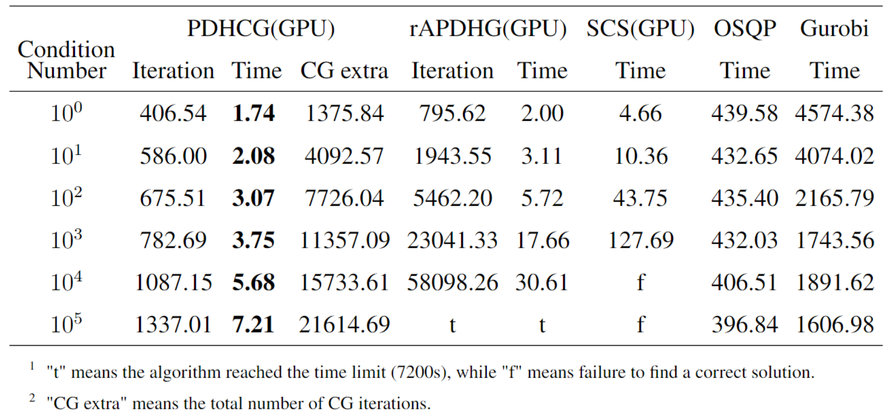
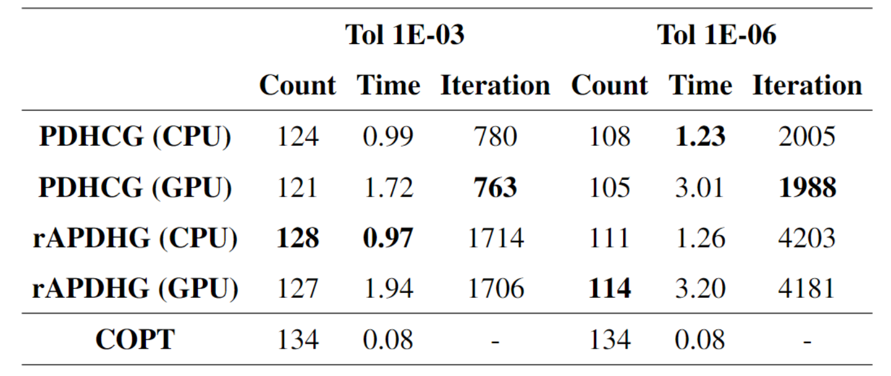
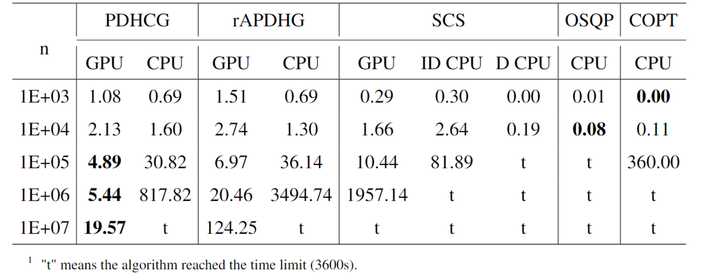
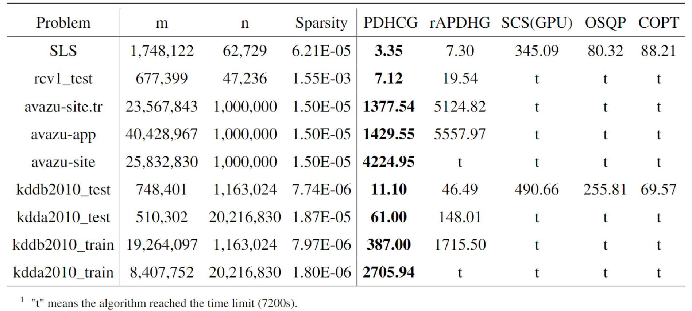

# [](https://pubsonline.informs.org/journal/ijoc)

# A Restarted Primal-Dual Hybrid Conjugate Gradient Method for Large-Scale Quadratic Programming

This archive is distributed in association with the [INFORMS Journal on
Computing](https://pubsonline.informs.org/journal/ijoc) under the [MIT License](LICENSE).

The software and data in this repository are a snapshot of the software and data
that were used in the research reported on in the paper 
[A Restarted Primal-Dual Hybrid Conjugate Gradient Method for Large-Scale Quadratic Programming](https://doi.org/10.1287/ijoc.2024.0983) by Y. Huang, W. Zhang, H. Li, H. Liu, D. Ge and Y. Ye. 


**Important: This code is being developed on an on-going basis at 
https://github.com/COPT-Public/PDHCG. Please go there if you would like to
get a more recent version or would like support**

## Cite

To cite the contents of this repository, please cite both the paper and this repo, using their respective DOIs.

https://doi.org/10.1287/ijoc.2024.0983

https://doi.org/10.1287/ijoc.2024.0983.cd

Below is the BibTex for citing this snapshot of the repository.

```
@misc{pdhcg,
  author =        {Y. Huang, W. Zhang, H. Li, H. Liu, D. Ge and Y. Ye},
  publisher =     {INFORMS Journal on Computing},
  title =         {A Restarted Primal-Dual Hybrid Conjugate Gradient Method for Large-Scale Quadratic Programming},
  year =          {2025},
  doi =           {10.1287/ijoc.2024.0983.cd},
  url =           {https://github.com/INFORMSJoC/2024.0983},
  note =          {Available for download at https://github.com/INFORMSJoC/2024.0983},
}  
```

## Description

This repository provides the data and solver suggested in **A Restarted Primal-Dual Hybrid Conjugate Gradient Method for Large-Scale Quadratic Programming**.

## Data
See `data/READNE.md`.

## Output Intepretation

A table of iteration stats will be printed with the following headings.

- Runtime

  - `#iter`: the current iteration number.
  - `#kkt`: the cumulative number of times the KKT matrix is multiplied.
  - `seconds`: the cumulative solve time in seconds.

- Residuals

  - `pr norm`: the Euclidean norm of primal residuals (i.e., the constraint violation).
  - `du norm`: the Euclidean norm of the dual residuals.
  - `gap`: the gap between the primal and dual objective.

- Solution Information

  - `pr obj`: the primal objective value.
  - `pr norm`: the Euclidean norm of the primal variable vector.
  - `du norm`: the Euclidean norm of the dual variable vector.

- Relative residuals

  - `rel pr`: the Euclidean norm of the primal residuals, relative to the right-hand side.
  - `rel dul`: the Euclidean norm of the dual residuals, relative to the primal linear objective.
  - `rel gap`: the relative optimality gap.
  

- Statistics
  - Total Iterations: The total number of Primal-Dual iterations.

  - CG  iteration: The total number of Conjugate Gradient iterations.

  - Solving Status: Indicating if it found an optimal solution.


## Results

### Theoretical Advantage

| Method | outer loop complexity | extra CG steps |
| :--- | :--- | :--- |
| rAPDHG | $\mathcal{O}\left(\left(\|A\|+\sqrt{\|Q\|}+\frac{\|Q\|}{\|A\|}\right) \log \frac{1}{\epsilon}\right)$ | - |
| PDHCG-fixed | $\mathcal{O}\left(\left(\|A\|+\sqrt{\gamma_K^N\|Q\|}+\frac{\gamma_K^N\|Q\|}{\|A\|}\right) \log \frac{1}{\epsilon}\right)$ | $N$ |
| PDHCG-adaptive | $\mathcal{O}\left(\|A\| \cdot \log \frac{1}{\epsilon}\right)$ | $\log_{r} \frac{\zeta}{2(1+\tau\|A\|)(1+\tau\|Q\|)}$ |

The constants $\gamma_K \in (0, 1), r, \tau, \zeta$ are constant numbers and will be specified in the paper.

**Compared to rAPDHG, PDHCG algorithm significantly reduces the dependency on $Q$.**

### Numerical Advantege
#### Comparison over different condition number



#### Experiment Over Public Benchmark


#### Comparison over generated large instances


#### Comparison over real-world large instances


## Compilation and Usage
See the document of our released version of [PDHCG](../../releases/tag/v0.1.0)

## Replicating
To replicate the experimental results as reported in the paper:
1. Follow the [data document](data/README.md), where all experiments data are supported, to generate MPS files.
2. Use [compiled PDHCG](../../releases/tag/v0.1.0) to solve MPS files.

## Ongoing Development

This code is being developed on an on-going basis at the author's
[Github site](https://github.com/COPT-Public/PDHCG).

## Support

For support in using this software, submit an
[issue](https://github.com/COPT-Public/PDHCG/issues/new).
